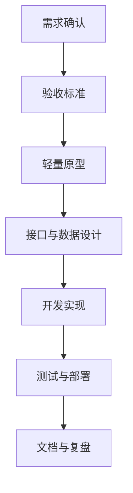

# 产品开发标准流程

## 1. 文档定位

这份文档用于约束本项目后续功能开发的默认工作方式。

目标不是把流程做重，而是避免下面几类常见偏差：

- 需求还没问清楚就直接开写
- 只说“差不多能用”，没有明确验收标准
- 页面和接口各自演进，数据模型后补
- 测试、部署、文档、复盘被放到最后，最后又来不及做

从这份文档开始，项目内涉及新功能、重要优化、较大重构时，默认按“先定义、再设计、后开发、可验证交付”的方式推进。

## 2. 适用范围

建议至少在下面几类工作中强制执行：

- 新业务功能
- 影响用户操作路径的页面改造
- 新增或修改外部接口
- 涉及表结构、状态流转、权限规则的改动
- 可能影响部署、配置、兼容性的工程改动

纯样式微调、简单文案修正、明确 Bug 修复，可以适当简化，但仍建议补齐最小验收和验证记录。

## 3. 核心流程

### 3.1 需求调研与问答，先把角色和约束问清楚

编码前至少要回答清楚以下问题：

- 谁在用这个能力
- 这个角色在什么场景下使用
- 想解决的核心问题是什么
- 现状为什么不够用
- 哪些属于本次范围，哪些明确不做
- 有哪些权限、数据、性能、时间上的约束
- 是否依赖现有模块、历史数据或外部系统

建议最少整理出 1 份需求问答记录，内容包括：

- 目标用户与角色
- 使用场景
- 输入输出
- 成功标准
- 非目标范围
- 已知约束
- 待确认问题

如果连角色、边界、约束都还没说清楚，不进入开发。

### 3.2 编写详细的验收标准，不再用“差不多可以”验收

验收标准必须可执行、可观察、可判断，不能写成抽象目标。

推荐至少覆盖下面几类：

- 正常流程是否跑通
- 异常输入如何处理
- 权限边界是否正确
- 空数据、重复数据、历史数据如何表现
- 接口返回结构是否稳定
- 页面提示、加载态、失败态是否明确
- 部署后最小冒烟路径是否可验证

推荐写法：

1. 给定什么前置条件
2. 当用户进行了什么操作
3. 系统应该返回什么结果

例如：

- 给定用户已登录且拥有应用 A，当进入聊天页并发送问题时，系统应返回流式回答且会话记录可追溯。
- 给定知识库未绑定任何文档，当触发公开问答时，系统应提示无可用知识而不是返回空白结果。

没有验收标准的需求，默认不进入开发排期。

### 3.3 绘制轻量级原型，先统一操作路径

这里强调“轻量级”，不要求每次都出高保真设计稿，但至少要把关键路径说明白。

可接受的原型形式包括：

- 文字版页面流程
- Markdown 表格描述页面区块
- Mermaid 流程图
- 手绘草图截图

原型至少要说清楚：

- 页面入口在哪里
- 页面包含哪些核心区域
- 用户一步步怎么操作
- 关键状态有哪些
- 成功、失败、空态分别如何表现

如果是跨页面流程，建议补一张简单流程图。

### 3.4 接口设计与数据建模，避免前后端各写各的

在进入正式开发前，需要先明确接口和数据结构。

接口设计至少要包含：

- 接口名称和用途
- 请求路径与方法
- 请求参数
- 响应字段
- 错误码或失败场景
- 权限要求
- 是否兼容旧接口

数据建模至少要包含：

- 需要新增或修改哪些表、字段、索引
- 字段含义与约束
- 状态枚举定义
- 数据归属与关联关系
- 历史数据兼容策略

如果接口设计和数据建模都没有先写出来，开发中途大概率会频繁返工。

### 3.5 测试用例设计及部署上线，开发不是提交代码就结束

测试用例设计要尽量前置，而不是代码写完才想“怎么测”。

至少要准备下面三层验证：

- 功能级：主流程、分支流程、异常流程
- 数据级：库表状态、关联关系、幂等性、历史数据兼容
- 部署级：配置项、启动检查、冒烟路径、回滚方式

上线前建议明确：

- 本次发布范围
- 影响模块
- 配置变更点
- SQL 变更点
- 冒烟测试步骤
- 回滚方案
- 负责人和执行顺序

如果一个需求没有部署验证路径，就说明它还没有真正交付完成。

### 3.6 项目文档编写与复盘总结，让经验能被复用

开发完成后，至少补齐两类内容：

- 面向后续协作者的文档
- 面向本次迭代的复盘记录

文档更新建议包括：

- 功能说明
- 接口说明
- 配置说明
- 测试结论
- 已知限制

复盘建议至少回答：

- 这次做对了什么
- 哪些地方返工最多
- 哪些前置问题其实可以更早暴露
- 以后同类需求应该复用什么模板或检查项

没有复盘的项目，容易重复踩同样的坑。

## 4. 交付物清单

一个相对完整的功能开发，建议至少产出下面这些文档或记录：

- 需求问答记录
- 验收标准
- 轻量原型
- 接口设计说明
- 数据建模说明
- 测试用例与验证结果
- 上线说明或冒烟记录
- 文档更新记录
- 复盘总结

不是每次都要拆成 9 份独立文件，但这些信息不能缺席。

## 5. 最小执行标准

如果希望流程别太重，可以执行项目的“最小标准版”：

1. 先写清楚需求背景、角色、范围、约束
2. 写出 5 到 10 条可判断的验收标准
3. 画出 1 份轻量原型或流程图
4. 定义接口与数据结构
5. 列出测试用例、冒烟步骤、回滚方式
6. 开发完成后更新文档并做一次简短复盘

这 6 步走完，已经能显著降低“边写边猜”的问题。

## 6. 推荐落地方式

建议后续每个较大的需求都在 `文档/开发文档` 下新增一份方案文档，文件名可参考：

- `YYYY-MM-DD_功能名_需求与方案.md`
- `YYYY-MM-DD_功能名_测试与上线记录.md`
- `YYYY-MM-DD_功能名_复盘总结.md`

如果需求较小，也可以合并为一份文档，但顺序仍建议保持：

1. 需求调研与问答
2. 验收标准
3. 轻量原型
4. 接口设计与数据建模
5. 测试与部署
6. 文档更新与复盘

## 7. 进入开发前的检查清单

开始写代码前，至少自查一遍：

- 角色和使用场景是否明确
- 本次范围和非范围是否明确
- 验收标准是否能逐条判断
- 页面或流程原型是否已经统一
- 接口和数据结构是否已经定稿
- 是否知道怎么测试、怎么上线、怎么回滚
- 这次改动需要同步更新哪些文档

如果以上问题有 3 个以上回答不清楚，建议先别继续开发。
