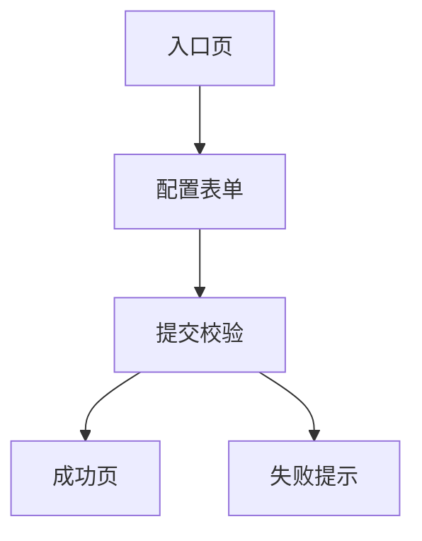

# 需求方案与验收模板

## 1. 使用方式

这份文档不是理论说明，而是给后续功能开发直接套用的模板。

建议做法：

1. 新需求立项时复制本模板
2. 先补齐需求问答和验收标准
3. 再继续原型、接口、数据、测试和上线内容
4. 开发完成后补齐验证结果和复盘

建议文件名：

- `YYYY-MM-DD_功能名_需求与方案.md`

---

## 2. 模板正文

```md
# <功能名> 需求与方案

## 1. 背景与目标

- 提出人：
- 需求日期：
- 目标版本：
- 业务背景：
- 当前问题：
- 本次目标：

## 2. 需求调研与问答

### 2.1 角色定义

- 主要角色：
- 次要角色：
- 相关管理角色：

### 2.2 使用场景

- 场景 1：
- 场景 2：
- 场景 3：

### 2.3 核心问题

- 用户希望完成什么：
- 当前链路卡在哪里：
- 为什么现在必须做：

### 2.4 范围边界

- 本次要做：
- 本次不做：

### 2.5 约束条件

- 权限约束：
- 数据约束：
- 性能约束：
- 时间约束：
- 兼容性约束：

### 2.6 待确认问题

- [ ] 问题 1：
- [ ] 问题 2：
- [ ] 问题 3：

## 3. 验收标准

### 3.1 功能验收

- [ ] 给定 <前置条件>，当 <用户操作> 时，系统应 <预期结果>
- [ ] 给定 <前置条件>，当 <用户操作> 时，系统应 <预期结果>
- [ ] 给定 <前置条件>，当 <用户操作> 时，系统应 <预期结果>

### 3.2 异常与边界验收

- [ ] 空数据场景表现明确
- [ ] 重复提交场景表现明确
- [ ] 非法参数场景表现明确
- [ ] 无权限访问场景表现明确
- [ ] 历史数据兼容场景表现明确

### 3.3 非功能验收

- [ ] 页面加载和交互耗时在可接受范围
- [ ] 关键日志可追踪
- [ ] 错误提示对用户可理解
- [ ] 不破坏现有接口兼容性

## 4. 轻量级原型

### 4.1 页面/流程说明

- 页面入口：
- 页面区块：
- 关键操作：
- 成功态：
- 失败态：
- 空态：

### 4.2 原型草图

可选形式：

- Markdown 文本草图
- Mermaid 流程图
- 截图或手绘图

示例：



## 5. 接口设计

### 5.1 接口清单

| 接口 | 方法 | 用途 | 权限 |
| --- | --- | --- | --- |
| `/example/path` | `GET/POST` | 示例用途 | 登录/管理员/公开 |

### 5.2 请求与响应

#### 接口 1：<接口名>

- 请求路径：
- 请求方法：
- 请求参数：
- 响应字段：
- 错误码：
- 兼容性说明：

## 6. 数据建模

### 6.1 涉及实体/表

- 新增表：
- 修改表：
- 关联表：

### 6.2 字段设计

| 字段 | 类型 | 含义 | 是否必填 | 备注 |
| --- | --- | --- | --- | --- |
| `example_field` | `varchar(64)` | 示例字段 | 是 | 唯一约束 |

### 6.3 状态与约束

- 状态枚举：
- 唯一约束：
- 索引需求：
- 历史数据兼容策略：

## 7. 技术方案与改动点

### 7.1 后端改动

- 涉及模块：
- 涉及类：
- 核心逻辑：

### 7.2 前端改动

- 涉及页面：
- 涉及组件：
- 交互说明：

### 7.3 风险点

- 风险 1：
- 风险 2：
- 风险 3：

## 8. 测试用例设计

### 8.1 功能测试

| 编号 | 场景 | 操作 | 预期结果 |
| --- | --- | --- | --- |
| TC-01 | 正常主流程 | xxx | xxx |
| TC-02 | 空数据 | xxx | xxx |
| TC-03 | 无权限 | xxx | xxx |

### 8.2 数据验证

- 需要检查的表：
- 需要检查的字段：
- 需要检查的状态流转：

### 8.3 部署与冒烟

- 配置变更：
- SQL 变更：
- 启动检查：
- 冒烟路径：
- 回滚方案：

## 9. 实施计划

- 开发顺序：
- 联调顺序：
- 测试顺序：
- 上线顺序：

## 10. 文档更新清单

- [ ] 更新功能说明
- [ ] 更新接口文档
- [ ] 更新部署文档
- [ ] 更新测试记录
- [ ] 更新已知问题

## 11. 验证结果

- 自测结论：
- 联调结论：
- 冒烟结论：
- 未解决问题：

## 12. 复盘总结

- 做得好的地方：
- 返工点：
- 暴露出的流程问题：
- 下次可复用的经验：
```

---

## 3. 补充建议

### 3.1 什么时候可以简化

如果只是小改动，可以至少保留下面几个章节：

- 背景与目标
- 需求调研与问答
- 验收标准
- 接口设计
- 测试与部署
- 验证结果

### 3.2 什么时候不能省

下面几类需求，不建议省略模板内容：

- 需要改表结构
- 需要改权限判断
- 需要增加公开接口
- 需要影响用户核心流程
- 需要发布上线验证

### 3.3 写模板时的常见误区

- 不要把“目标”写成“实现某某接口”
- 不要把“验收标准”写成“功能正常”
- 不要只写正常流程，不写异常流程
- 不要只有接口没有数据模型
- 不要开发完成后不补验证结果
